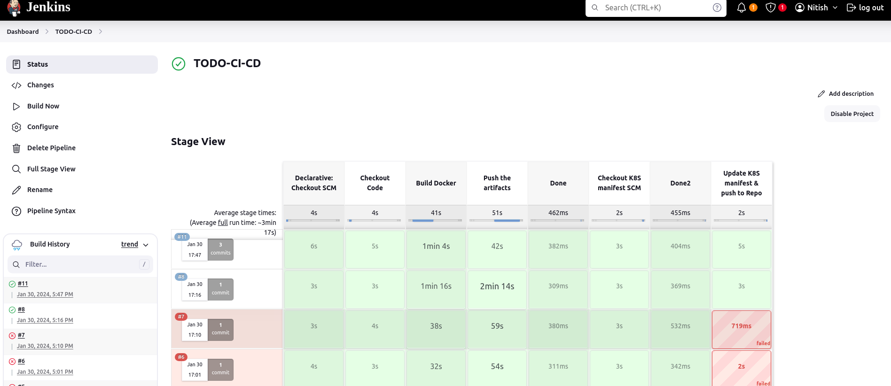

# Complete CI-CD Pipeline of TODO app


## 1. Jenkins and minikube Installation 
https://github.com/nitish0104/scripts

**Note** : Install all required plugins in jenkins. and add credentials of Docker and Github to Jenkins(username and Tokens)

## 2. Create a pipeline job for gitrepo.

**Note**: Before Build you must specify following command in ubuntu terminal.
```sh
sudo usermod -aG docker jenkins
sudo service jenkins restart
sudo chmod 666 /var/run/docker.sock
sudo service docker restart
sudo reboot
```

## 3. Argocd Installation
https://github.com/nitish0104/argocd-demo

Run the below code in terminal
```sh 
kubectl create secret generic argocd-repo-secret \
  --from-literal=github.token=<Your Github Token> \
  -n argocd
secret/argocd-repo-secret created
```

**Note** :
 1. After Login Update your password .
 2. Add the github credentials .(settings>Repository>New)
 3. Add the Applications you want to deploy using ArgoCD . In this case we will be adding (https://github.com/nitish0104/ToDo-mainfest-repo)


## 4. Build the jenkins pipeline 

**Note** : Check the version of docker image present in Deploy.yaml file and that version must be add on jenkins file <sed -i "s|8|${BUILD_NUMBER}|g" Deploy.yaml> .Here Replace 8 with Deploy.yaml docker image version 
    
## 5. Final Output



